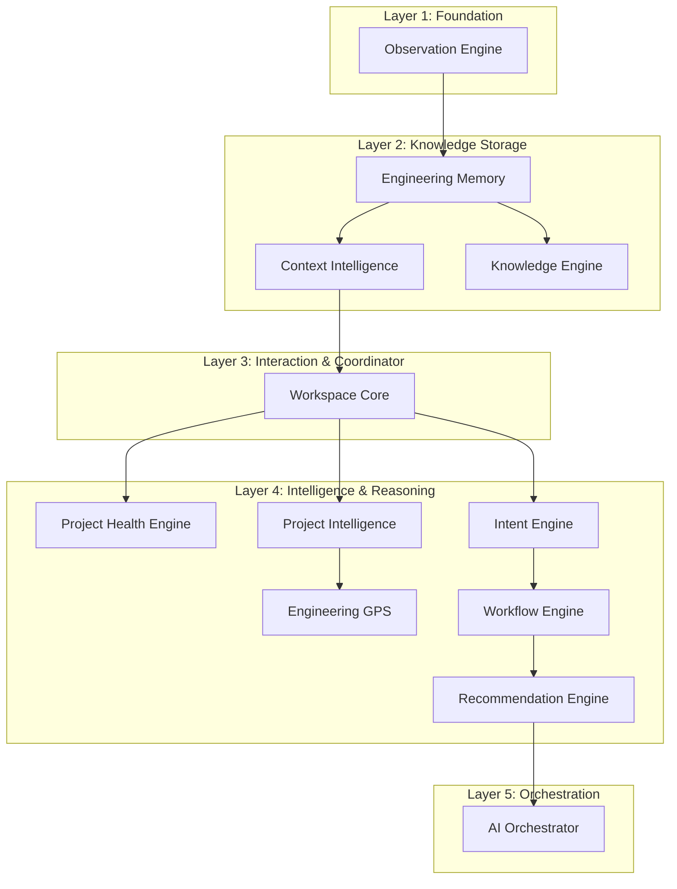

# Implementation Roadmap

**Version:** 1.0  
**Status:** Approved Specification  
**Author:** Lead Software Architect  
**Date:** July 2026  

---

# 1. Build Strategy & Subsystem Build Order

To minimize coupling, rework, and temporary abstractions, the build sequence follows a **bottom-up approach** based on structural compilation and data flow dependencies rather than conceptual importance. Foundational data collection and storage layers must be built and validated before building the reasoning and orchestration layers that consume them.



### Subsystem Build Order
1.  **Observation Engine**: Emits raw, factual events from files and workspaces. Depends on nothing.
2.  **Engineering Memory**: Archives raw facts and decisions. Depends on the Observation Engine.
3.  **Context Intelligence**: Assembles read-only Context Packages from Memory and Project State.
4.  **Workspace Core**: Standard session manager and router. Coordinates basic command/data flows.
5.  **Project Health Engine**: Assesses code, testing, and documentation quality.
6.  **Project Intelligence**: Tracks current goals, focus, and state.
7.  **Intent Engine**: Forms intent hypotheses from signals and conversation.
8.  **Knowledge Engine**: Extracts local pattern heuristics.
9.  **Engineering GPS**: Calculates navigation routes toward project goals.
10. **Recommendation Engine**: Generates alternatives, trade-offs, and reasoned guidance.
11. **AI Orchestrator**: Manages model interactions, proactivity calibration (Trust), and conversations.

---

# 2. Minimal Viable Intelligence (MVI) v0.1 Specification

To validate the product vision with minimal complexity, Version 0.1 is strictly limited to **one active local workspace and single-project scope**.

| Subsystem | Included in MVI v0.1 | Excluded from MVI v0.1 |
| :--- | :--- | :--- |
| **Workspace Core** | Single-project session management; local routing. | Multi-workspace sessions; workspace sync. |
| **Observation Engine** | Passive filesystem, git commit, and conversation monitoring. | Real-time IDE window focus tracking. |
| **Engineering Memory** | Local JSON/SQLite storage of decisions, rationale, and raw logs. | Cloud-based memory sync; vector search clustering. |
| **Context Intelligence** | Local file content query and history retrieval. | Semantic multi-file context compression/embeddings. |
| **Intent Engine** | Heuristic matching of conversational inputs and file modifications. | Advanced machine learning intent classifiers. |
| **Project Health Engine** | Hardcoded heuristics for testing coverage, documentation age, and TODO count. | Dynamic custom quality metric suites. |
| **Project Intelligence** | Simple markdown-based goal tracking and active focus storage. | Multi-user goal dependencies. |
| **Knowledge Engine** | Local list of static engineering guidelines and common patterns. | Cross-project pattern learning; global KB syncing. |
| **Engineering GPS** | Linear route mapping towards defined goals. | Multi-path heuristic route navigation. |
| **Recommendation Engine** | Single-path recommendation with basic pros/cons list. | Multi-alternative semantic trade-off analysis. |
| **Workflow Engine** | Basic sequential execution of playbooks. | Parallel/nested workflow coordination and branches. |
| **AI Orchestrator** | Reactive conversation mode; simple proactivity toggle. | Trust-based auto-adjusting interaction levels. |

---

# 3. Module Boundaries & Decoupling

To prevent circular structural dependencies during implementation, we establish the following API contracts and decoupling rules:

1.  **Asynchronous Events**: Subsystems must communicate state changes by publishing asynchronous events rather than invoking synchronous API calls. E.g., when the Observation Engine detects a file change, it emits an `ObservationDetectedEvent`.
2.  **Read-Only State Access**: Subsystems requiring project state (like Context Intelligence querying Project Intelligence) must do so via a read-only query DTO. Under no circumstances should Context Intelligence modify Project State.
3.  **Decoupled Observation**: The Observation Engine must have zero knowledge of context, intent, or recommendations. It is a one-way producer of raw facts.
4.  **No Circular References**: High-level intelligence engines (e.g., Recommendation Engine) depend on Knowledge and Context, but the lower layers must never depend on the higher layers.

---

# 4. Phased Roadmap

```
  Milestone 1: Foundation      Milestone 2: Intelligence    Milestone 3: Orchestration & MVP
+--------------------------+  +--------------------------+  +--------------------------------+
|  - Passive Observation   |  |  - Project Health        |  |  - Recommendation Engine       |
|  - Local Memory DB       |  |  - Goal Tracking (PI)    |  |  - Reactive AI Orchestrator    |
|  - Context Selection API |  |  - Sequential Playbooks  |  |  - Single-project End-to-End   |
+--------------------------+  +--------------------------+  +--------------------------------+
```

### Phase 1: Foundation (Milestone 1)
*   **Objectives**: Setup local project architecture, implement the passive Observation Engine, write to the SQLite/JSON local Engineering Memory, and build Context Intelligence query APIs.
*   **Success Criteria**: Changing a file in the workspace generates a factual observation log in the database, which is successfully retrieved by a Context Package query.

### Phase 2: Intelligence & Workflows (Milestone 2)
*   **Objectives**: Implement Project Health diagnostics, Project State/Goal tracking, and sequential playbooks inside the Workflow Engine.
*   **Success Criteria**: The workspace tracks when a testing goal is active, running health diagnostics when changes occur, and advances a workflow step-by-step.

### Phase 3: Guidance & Orchestration (Milestone 3 - MVI v0.1 Release)
*   **Objectives**: Build the Recommendation Engine (generating basic alternatives and trade-offs) and AI Orchestrator (managing conversation flows and displaying recommendations).
*   **Success Criteria**: The developer can execute a feature-development workflow, receive memory-grounded recommendations for architecture decisions, and accept them, automatically updating the project's historical memory.

---

# 5. Verification & Testing Strategy

### 5.1 Automated Subsystem Testing
Each subsystem must be validated independently:
-   **Observation Engine**: Write integration tests that simulate file creations/modifications and verify that correct `Observation` records are emitted.
-   **Engineering Memory**: Validate database schema integrity, transaction rollbacks, and read performance constraints for large history tables.
-   **Context Intelligence**: Create tests with mock project states and verify that Context Packages remain under the LLM token budget limits (e.g. context compression checks).
-   **Recommendation Engine**: Feed mock contexts and verify that recommendations always include a "reasoning" and "alternatives" block.

### 5.2 Manual Integration Testing
-   **End-to-End Simulation**: Run a script that performs a mock development cycle (planning → implementing → testing → deploying) and inspect the generated `ARCHITECTURE_REVIEW.md` and `IMPLEMENTATION_ROADMAP.md` in the development directory.
-   **Invariant Checks**: Perform automated linting/architecture rule verification to ensure no subsystem introduces circular dependency imports or violates the implementation invariants.

---

# 6. Implementation Invariants

These structural invariants are enforced as hard contracts for all future contributors:

1.  **Factual Observations**: Observations recorded by the Observation Engine must represent objective, immutable facts. They must never contain assumptions, judgments, or recommendations.
2.  **Hypothetical Intent**: Intent must always have an associated confidence level. The system must never treat an inferred intent as an absolute certainty.
3.  **Engineering Memory is the authoritative historical source**: No subsystem may store its own historical decision records. All history, rationale, and alternatives must flow through and be retrieved from Engineering Memory.
4.  **Context selects rather than stores**: Context Intelligence is a stateless query-and-filter engine. It must never persist project data.
5.  **Knowledge must always be validated**: The Knowledge Engine must validate extracted lessons and patterns before exposing them as active knowledge. Unvalidated patterns remain classified as hypotheses.
6.  **Recommendations never bypass reasoning**: The Recommendation Engine must never output a recommendation without generating its accompanying reasoning, alternatives, and trade-offs.
7.  **GPS provides navigation, not task management**: Engineering GPS calculates routes and trajectories toward goals. It must never manage developer TODO lists or track developer task completion.
8.  **Stateless Workspace Core**: The Workspace Core coordinates subsystem routing and session lifecycles. It must never perform engineering reasoning or contain domain-specific intelligence.
