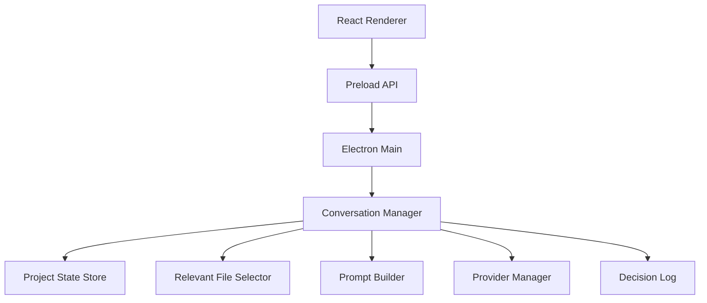
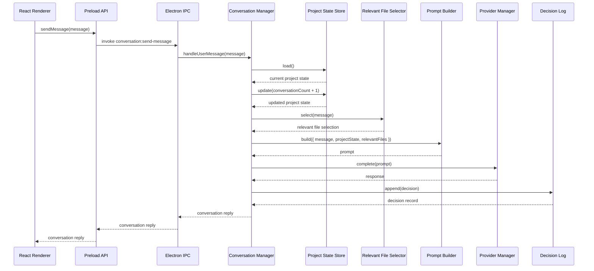

# Runtime Architecture

**Version:** 0.1  
**Status:** Milestone 1 Implementation Reference  
**Date:** July 2026

---

# Purpose

This document describes the runtime implementation that exists after Milestone 1.

It is not a redesign of the frozen architecture. It records how the current Electron, React, TypeScript, and Vite foundation implements the first runtime slice:

Developer message -> Project State -> Relevant File Selector -> Prompt Builder -> Provider Manager -> Response -> Decision Log -> UI

Milestone 1 intentionally contains no reasoning engine, semantic search, embeddings, recommendation logic, workflow logic, or model routing implementation.

---

# Runtime Architecture

The application is an Electron desktop app with three runtime surfaces:

1. **Electron main process**
   - Owns filesystem access.
   - Creates the desktop window.
   - Registers IPC handlers.
   - Instantiates runtime modules and wires the conversation flow.

2. **Electron preload script**
   - Exposes a narrow, typed API to the renderer through `contextBridge`.
   - Keeps the renderer isolated from Node.js and Electron internals.

3. **React renderer**
   - Renders the application shell.
   - Captures user messages.
   - Calls the preload API.
   - Displays responses and status.

The runtime is local-first. In development, `project.json` and `decisions.jsonl` are stored in the app root. In a packaged app, they are stored in Electron's `userData` directory so the app does not attempt to write into packaged application files.

---

# Folder Structure

```text
src/
  main/
    ai/
      interfaces.ts
      prompt-builder.ts
      provider-manager.ts
    conversation/
      conversation-manager.ts
      types.ts
    decision-log/
      decision-log.ts
      types.ts
    project-state/
      project-state-store.ts
      types.ts
    relevant-file-selector/
      relevant-file-selector.ts
      types.ts
    main.ts
  preload/
    index.ts
  renderer/
    main.tsx
    styles.css
    vite-env.d.ts
```

Only folders required by Milestone 1 exist. No placeholder subsystem folders were created for later milestones.

---

# Module Responsibilities

## `src/main/main.ts`

Responsible for Electron process bootstrapping.

It:
- Determines runtime paths.
- Creates the main window.
- Applies Electron security defaults for the renderer.
- Instantiates Milestone 1 modules.
- Registers the `conversation:send-message` IPC handler.

It does not contain business logic, prompt logic, file selection logic, persistence logic, or AI behavior.

## `src/preload/index.ts`

Responsible for exposing the renderer API.

It exposes one method:
- `sendMessage(message: string): Promise<ConversationReply>`

The renderer does not receive direct access to Node.js, Electron IPC, or filesystem APIs.

## `src/renderer/main.tsx`

Responsible for the application shell UI.

It renders:
- Sidebar
- Header
- Chat area
- Composer
- Status bar

It owns local view state for visible messages, draft input, and status text. It does not read or write project files directly.

## `src/main/conversation/conversation-manager.ts`

Responsible for the Milestone 1 conversation flow.

It coordinates existing modules in this order:

1. Load and update Project State.
2. Select relevant files.
3. Build prompt.
4. Request provider response.
5. Append decision record.
6. Return data to UI.

It does not perform reasoning, ranking, semantic search, validation, caching, routing, or persistence itself.

## `src/main/project-state/project-state-store.ts`

Responsible for `project.json` persistence.

It provides:
- `load()`
- `update(update)`
- `save(state)`

The module creates a default state if `project.json` does not exist. It validates the loaded JSON shape before returning it.

## `src/main/decision-log/decision-log.ts`

Responsible for append-only `decisions.jsonl` persistence.

It provides:
- `append(decision)`
- `read()`
- `queryRecent(limit)`

The module writes one JSON record per line. It does not update or delete historical records.

## `src/main/relevant-file-selector/relevant-file-selector.ts`

Responsible for lightweight context file selection.

It loads:
- `package.json`
- `tsconfig.json`
- Recently modified text files
- Files explicitly referenced by the user

It does not use embeddings, semantic search, ranking, summaries, or model-based relevance.

## `src/main/ai/prompt-builder.ts`

Responsible for constructing the prompt string from the user message, project state, and selected files.

It does not call providers, mutate state, read files, or validate model responses.

## `src/main/ai/provider-manager.ts`

Responsible for the provider boundary.

In Milestone 1 it returns a deterministic local foundation response. It does not call external AI providers yet.

## `src/main/ai/interfaces.ts`

Responsible for defining future AI boundary interfaces only.

It defines:
- `ResponseValidator`
- `Cache`
- `CostTracker`
- `ModelRouter`

These are intentionally unimplemented in Milestone 1.

---

# Dependency Graph



The dependencies are one-way. Lower-level modules do not import the Conversation Manager, renderer, or Electron window code.

---

# Data Flow

```text
User message
  -> React renderer
  -> Preload API
  -> Electron IPC handler
  -> Conversation Manager
  -> Project State Store
  -> Relevant File Selector
  -> Prompt Builder
  -> Provider Manager
  -> Decision Log
  -> IPC response
  -> React renderer
```

This matches the Milestone 1 requested runtime flow.

---

# Conversation Manager Sequence



---

# Public Interfaces

## Renderer API

```ts
interface CompanionApi {
  sendMessage(message: string): Promise<ConversationReply>;
}
```

## Conversation Manager

```ts
interface ConversationManager {
  handleUserMessage(userMessage: string): Promise<ConversationReply>;
}
```

## Project State Store

```ts
interface ProjectStateStore {
  load(): Promise<ProjectState>;
  update(update: ProjectStateUpdate): Promise<ProjectState>;
  save(state: ProjectState): Promise<void>;
}
```

## Decision Log

```ts
interface DecisionLog {
  append(decision: Omit<DecisionRecord, 'id' | 'createdAt'>): Promise<DecisionRecord>;
  read(): Promise<DecisionRecord[]>;
  queryRecent(limit: number): Promise<DecisionRecord[]>;
}
```

## Relevant File Selector

```ts
interface RelevantFileSelector {
  select(userMessage: string): Promise<RelevantFileSelection>;
}
```

## Prompt Builder

```ts
interface PromptBuilder {
  build(input: PromptBuilderInput): string;
}
```

## Provider Manager

```ts
interface ProviderManager {
  complete(prompt: string): Promise<string>;
}
```

## Future AI Interfaces

```ts
interface ResponseValidator {
  validate(response: string): Promise<boolean>;
}

interface Cache {
  get(key: string): Promise<string | undefined>;
  set(key: string, value: string): Promise<void>;
}

interface CostTracker {
  recordUsage(inputTokens: number, outputTokens: number): Promise<void>;
}

interface ModelRouter {
  selectModel(prompt: string): Promise<string>;
}
```

---

# Implementation Decisions

## Electron Security

The renderer runs with:
- `contextIsolation: true`
- `nodeIntegration: false`
- `sandbox: true`

The renderer communicates through a narrow preload API rather than direct IPC access.

## Persistence

Milestone 1 uses:
- `project.json` for lightweight project state.
- `decisions.jsonl` for append-only decision records.

The decision log appends records only. No update or delete operation exists.

## File Selection

The Relevant File Selector is intentionally lightweight. It loads a bounded set of files and filters to known text extensions to avoid accidental binary reads.

## Provider Boundary

The Provider Manager exists as the AI provider boundary, but does not call external services in Milestone 1. This keeps the foundation runnable without credentials or network access.

## Dependency Injection

The Conversation Manager receives its dependencies as constructor parameters. This keeps coordination testable without introducing a container, service locator, or framework-level dependency injection.

---

# Known Limitations

- There is no workspace picker yet; the app currently treats the application root as the selected project root.
- The Provider Manager returns a deterministic local response instead of calling a real AI provider.
- The Prompt Builder creates a simple text prompt and does not include token budgeting or structured sections beyond Milestone 1 needs.
- Project State has basic shape validation only; there is no schema migration system.
- Decision Log reads the full JSONL file into memory for `read()` and `queryRecent()`.
- Relevant File Selector walks the project tree on demand and does not maintain an index.
- Renderer state is local only; refreshing the renderer resets visible chat messages while persisted decisions remain on disk.
- There are no automated tests yet; verification currently uses TypeScript, ESLint, and production build checks.

---

# Future Extension Points

These are extension points already represented by interfaces or module boundaries. They are not implemented in Milestone 1.

- Replace the deterministic Provider Manager response with a real provider adapter.
- Implement `ResponseValidator` behind the AI boundary.
- Implement `Cache` behind the AI boundary.
- Implement `CostTracker` behind the AI boundary.
- Implement `ModelRouter` behind the AI boundary.
- Add workspace selection so file selection and persistence target a developer-selected project.
- Add tests around Conversation Manager sequencing and persistence modules.
- Add bounded file-size handling in Relevant File Selector before larger workspaces are supported.

---

# Alignment With Frozen Architecture

The implementation preserves the frozen architecture by keeping responsibilities separated:

- Workspace coordination remains in Electron main process wiring and Conversation Manager sequencing.
- Project State owns state persistence only.
- Relevant File Selector selects context only.
- Prompt Builder builds prompts only.
- Provider Manager owns the provider boundary only.
- Decision Log persists decisions only.
- The renderer remains a UI shell.

No reasoning, recommendation generation, semantic search, embeddings, workflow execution, health assessment, or future intelligence subsystem behavior was introduced in Milestone 1.
